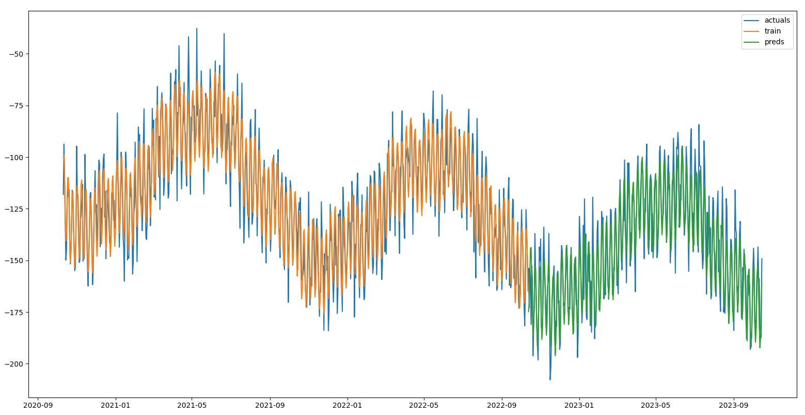
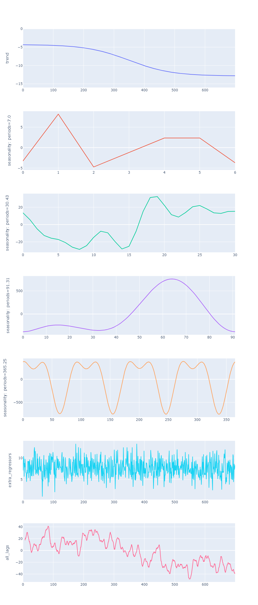

# FourierForecast
A time-series forecaster that fits by decomposing a daily time-series into seasonality, trend
and optional regressors.
 
- Fits seasonality & Fourier terms specified
- Fits specified trend type (e.g. linear, flat, logistic, logarithmic)
- Fits exogenous regressors
- Fits specified number of lag terms
- Option to include terms for regularizing fit for different types of component
- Optional log transform of time-series to model interaction amongst components (not just interaction with trend)
- Components can be visualised with plot_components method

### Blog posts:
 - [Part I](https://medium.com/@jcatankard_76170/forecasting-with-fourier-series-8196721e7a3a)
 - [Part II](https://medium.com/@jcatankard_76170/forecasting-with-fourier-series-part-ii-f74bdeaf1722)

### Seasonality:
- For best performance, aim to include at least two cycles of the largest seasonal component to be fitted 
- Multiple waves per seasonality are fit according to the specified Fourier order
    - more terms results in better fit but can result in over-fitting
- Seasonal periods are set by pre-determined values:
   - weekly seasonality: 7 days
   - monthly seasonality: 30.43 days
   - quarterly seasonality: 91.31 days
   - yearly seasonality: 365.25 days

### Future updates:
 - prediction intervals

## FourierForecast
### Parameters
- growth: str, default='linear'. Possible values 'linear', 'flat', 'logistic', 'logarithmic'.
- weekly_seasonality_terms: int, default=3
    - number of Fourier terms to generate for fitting seasonality of 7 days
- monthly_seasonality_terms: int, default=0
    - number of Fourier terms to generate for fitting seasonality of 30.43 days
- quarterly_seasonality_terms: int, default=0
    - number of Fourier terms to generate for fitting seasonality of 91.31 days
- yearly_seasonality_terms: int, default=10
    - number of Fourier terms to generate for fitting seasonality of 365.25 days
- trend_reg: float, default=0
    - parameter regulating strength of trend fit
    - smaller values (~0-1) allow the model to fit larger seasonal fluctuations,
    - larger values (~1-100) dampen the seasonality.
- seasonality_reg: float, default=0
    - parameter regulating strength of seasonality fit
    - smaller values (~0-1) allow the model to fit larger seasonal fluctuations,
    - larger values (~1-100) dampen the seasonality.
- regressor_reg: float, default=0
    - parameter regulating strength of regressors fit
    - smaller values (~0-1) allow the model to fit larger seasonal fluctuations,
    - larger values (~1-100) dampen the seasonality.
- ar_reg: float, default=0
    - parameter regulating strength of fit against lags
    - smaller values (~0-1) allow the model to fit larger seasonal fluctuations,
    - larger values (~1-100) dampen the seasonality.
- log_y: bool, default=True
    - takes the natural logarithm of the timeseries before fitting (and the exponent after predicting)
    - all values must be positive or reverts back to False
    - useful for fitting interactive effects between seasonality, trend and regressors

### Methods
 - fit
   - y: NDArray[float]
     - daily time-series ordered by date
   - regressors: NDArray[float], default=None
     - optional regressors for fitting non-seasonal components ordered by date
   - sample_weight: NDArray[float], default=None
     - individual weights for each sample
 - predict
   - h: int, default=1
     - number of horizons to predict
   - regressors: NDArray[float], default=None
     - regressors corresponding to days to predict 
     - if regressors are present during fitting, these must have the same number of features
     - if None is passed, then all values will assume to be 0.
 - fitted
   - returns fitted values


 - plot_components
   - plots bias, trends, individual seasonality terms, regressors and lags
 - plot_seasonality_components
   - plots individual seasonalities terms
 - plot_lag_components
   - plots individual lags in their own subplot
 - plot_regression_components
   - regressor_names: list[str], default=None
   - plots individual regressors as their own subplot

## Examples
### fit and predict example
```python
from fourier_forecast.fourier_forecast import FourierForecast
import plotly.graph_objs as go


dates = ...
actuals = ...

train_test_split = .8
n_train = int(len(dates) * train_test_split)
n_predict = len(dates) - n_train

train_dates = dates[: n_train]
train_actuals = actuals[: n_train]

ff = FourierForecast()
                     
ff.fit(train_actuals)
preds = ff.predict(h=n_predict)

fig = go.Figure()
fig.add_trace(go.Scatter(x=dates, y=actuals, mode='lines', name='actuals'))
fig.add_trace(go.Scatter(x=dates[: n_train], y=ff.fitted(), mode='lines', name='fitted'))
fig.add_trace(go.Scatter(x=dates[n_train:], y=preds, mode='lines', name='preds'))
fig.update_layout(showlegend=True)
fig.show()
```
<p float="left">
  
</p>

### regressor example with plot_components()
```python
from fourier_forecast.fourier_forecast import FourierForecast


actuals = ...
regressors = ...

ff = FourierForecast(weekly_seasonality_terms=3,
                     monthly_seasonality_terms=5,
                     quarterly_seasonality_terms=5,
                     yearly_seasonality_terms=7,
                     growth='logistic',
                     log_y=True,
                     n_lags=7
                     )
                     
ff.fit(actuals, regressors)
ff.plot_components()
```
<p float="left">
  
</p>