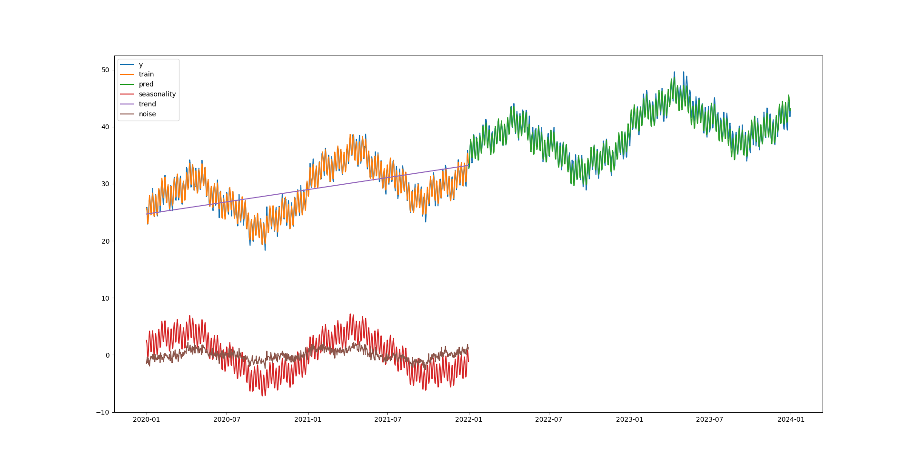

# fourier forecast
is developed to fit seasonal time series data by decomposing the signal and removing the noise

- uses fast fourier transformation and linear regression to infer seasonality from timeseries data
- unlike other timeseries models, user to not have to specify any seasonality as the aim is to infer it entirely from the data
- model should be able to adapt to training data with partial seasons (e.g. model yearly seasonality from 9 months or 14 months of data)
- though the more training data and more seasonal cycles the better is will fit
- user can add predictors such as holidays, sale days to improve forecast
- trend, seasonality and noise can all be returned in addition to the predictions


### class: FourierForecast(self, train_size=None, fourier_order=5)
#### Parameters
##### train_size
 - max number of rows used to fit data
#### fourier_order
 - represents granularity of seasonality to fit
 - higher values will capture more levels of seasonality but risks over-fitting

## methods
### FourierForecast.fit(df)
#### Parameters
##### df
 - pandas.DataFrame
 - needs to contain a datetime column labelled 'ds' and values column labelled 'y'
 - can optionally contain additional columns such as holidays to improve fit

### FourierForecast.predict(df)
#### parameters
##### df
 - pandas.DataFrame
 - needs to contain a datetime column labelled 'ds' and of the same frequency as dataframe that was fitted
 - should contain the same columns as fitted dataframe other than 'y'

## attributes
### self.coefs
 - return coefficients as a dictionary including intercept 
### self.seasonality
 - returns numpy array of the seasonality calculated for the timeseries
### self.trend
 - returns numpy array of the overall linear trend for the timeseries
### self.noise
 - returns numpy array of what is not considered part of the seasonality or trend

## examples
<p float="left">
  
</p>

```
import matplotlib.pyplot as plt
from fourier_forecast import FourierForecast
import pandas as pd
import numpy as np
import datetime


def create_signal(n: int) -> pd.DataFrame:
    dt = 1
    t = np.arange(0, n, dt)

    # create signal
    weekly_seasonality = 2 * np.cos(2 * np.pi * t / 7) + 7
    monthly_seasonality = 1 * np.sin(2 * np.pi * t / 30.43) + 12
    quarterly_seasonality = 1 * np.sin(2 * np.pi * t / 91.31) + 4
    yearly_seasonality = 5 * np.sin(2 * np.pi * t / 365.25) + 1
    trend = 20 * np.arange(n) / n
    y_clean = weekly_seasonality + yearly_seasonality + trend + quarterly_seasonality + monthly_seasonality
    y = y_clean + 0.5 * np.random.randn(n)

    df = pd.DataFrame()
    df['ds'] = pd.date_range(start=datetime.date(2020, 1, 1), periods=n)
    df['y'] = y

    return df


# fit
train_len = 731
test_len = 730
df = create_signal(train_len + test_len)
model = FourierForecast()
model.fit(df.head(train_len))
print(model.coefs)

# predict
df['pred'] = model.predict(df.drop(columns=['y']))
rmse = np.mean((df['pred'] - df['y']) ** 2) ** 0.5
print('rmse', rmse)

plt.plot(df['ds'], df['y'], label='y')
plt.plot(df['ds'][: train_len], df['pred'][: train_len], label='train')
plt.plot(df['ds'], np.where(df.index < train_len, np.nan, df['pred']), label='pred')

plt.plot(df['ds'][: train_len], model.seasonality, label='seasonality')
plt.plot(df['ds'][: train_len], model.trend, label='trend')
plt.plot(df['ds'][: train_len], model.noise, label='noise')

plt.legend()
plt.show()
```