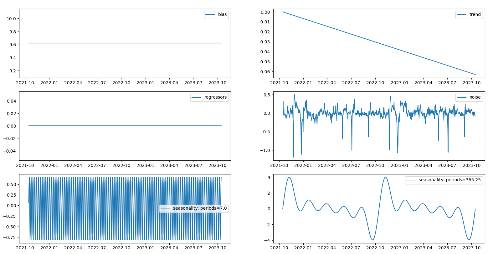

# FourierForecast
A time-series modelling approach that decomposes a daily time-series into seasonality, trend, bias,
optional regressors and noise.
 
- Seasonality types & Fourier terms are specified
- Seasonality components, trends, bias and regressors are fit with gradient descent
- Components can be visualised with plot_components method
- Numba is used for performance boost

[Medium blog post](https://medium.com/@jcatankard_76170/forecasting-with-fourier-series-8196721e7a3a)

### Seasonality:
- In theory seasonal components can be fitted with less training data than a full season
  - e.g. yearly seasonality can be fitted even when the training data covers just 9 months
    - however, for best performance, aim to include at least two cycles of the largest seasonal component to be fitted
  - multiple waves per seasonality are fit according to the specified Fourier order
    - more terms results in better fit but can result in over-fitting
  - fitting frequency by gradient descent does not result in stable outcomes so only amplitude and phase are fitted
  whilst seasonal periods are set by pre-determined values:
     - weekly seasonality: 7 days
     - monthly seasonality: 30.43 days
     - quarterly seasonality: 91.31 days
     - yearly seasonality: 365.25 days
  - for multiplicative seasonality, it may be best to log transform your time-series before fitting
    - where necessary it may also be appropriate to log transform some or all regressors

### Future updates:
 - prediction intervals
 - native handling of multiplicative seasonality
 - better default amplitude & trend estimations
 - add deploy to pip into pipeline

## FourierForecast
### Parameters
 - weekly_seasonality_terms: int, default=3
 - monthly_seasonality_terms: int, default=0
 - quarterly_seasonality_terms: int, default=0
 - yearly_seasonality_terms: int, default=10
   - number of fourier series components for each seasonality type
 - learning_rate: float, default=0.001
 - n_iterations: int, default=100_000
 - tol: float, default=1e-5
   - stops training if the max, absolute parameter update is smaller than tol

### Methods
 - fit
   - ds: NDArray[date]
     - ordered dates corresponding to each row of the training data
   - y: NDArray[float]
     - daily time-series ordered by date
   - regressors: NDArray[float], default=None
     - optional regressors for fitting non-seasonal components ordered by date
   - sample_weight: NDArray[float], default=None
     - individual weights for each sample
 - predict
   - ds: NDArray[date]
     - dates corresponding to days to predict
   - regressors: NDArray[float], default=None
     - regressors corresponding to days to predict 
     - if regressors are present during fitting, these must have the same number of features
     - if None is passed, then all values will assume to be 0.
 - plot_components
   - plots bias, trends, seasonality, regressors and noise

## Examples
### fit and predict example
```python
from fourier_forecast.fourier_forecast import FourierForecast
import matplotlib.pyplot as plt


dates = ...
actuals = ...

train_test_split = .8
n_train = int(len(dates) * train_test_split)

train_dates = dates[: n_train]
train_actuals = actuals[: n_train]

ff = FourierForecast()
                     
ff.fit(train_dates, train_actuals, regressors=None)
preds = ff.predict(ds=dates, regressors=None)

plt.plot(dates, actuals, label='actuals')
plt.plot(train_dates, preds[: n_train], label='train')
plt.plot(dates[n_train: ], preds[n_train: ], label='preds')
plt.legend()
plt.show()
```
<p float="left">
  
</p>

### regressor example with plot_components()
```python
from fourier_forecast.fourier_forecast import FourierForecast


dates = ...
actuals = ...
regressors = ...

ff = FourierForecast(weekly_seasonality_terms=1,
                     monthly_seasonality_terms=1,
                     quarterly_seasonality_terms=1,
                     yearly_seasonality_terms=1
                     )
                     
ff.fit(dates, actuals, regressors)
ff.plot_components()
```
<p float="left">
  
</p>

### fourier order example with plot_components()
```python
from fourier_forecast.fourier_forecast import FourierForecast


dates = ...
actuals = ...

ff = FourierForecast()
                     
ff.fit(dates, actuals)
ff.plot_components()
```
<p float="left">
  
</p>

### multiplicative seasonality example
```python
from fourier_forecast.fourier_forecast import FourierForecast
import numpy as np


dates = ...
actuals = ...
regressors = ...

train_test_split = .8
n_train = int(len(dates) * train_test_split)

ff = FourierForecast() 
ff.fit(ds=dates[: n_train],
       y=np.log(actuals[: n_train]),
       regressors=regressors[: n_train]
       )
preds = np.exp(
    ff.predict(ds=dates[n_train: ],
               regressors=regressors[n_train: ]
               )
)
mape = np.absolute(preds / actuals[n_train: ] - 1) / preds.size
print(mape)
```