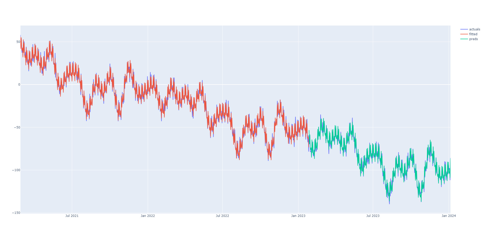

# FourierForecast
A time-series model that decomposes a daily time-series into seasonality, trend, bias, optional regressors and noise.
 
- The initial seasonality amplitude and phase are inferred by Fast Fourier Transformation
- This is then fine-tuned and fitted with the other components using gradient descent
- Components can be visualised with plot_components method
- Additive or multiplicative seasonality can be fitted
- Numba is used for performance boost

### Seasonality:
- In theory seasonal components can be fitted with less training data than a full season
  - e.g. yearly seasonality can be fitted even when the training data covers just 9 months
  - however, for best performance, aim to include at least two cycles of the largest seasonal component to be fitted
  - at this moment, only one wave is fitted per seasonal component which means nuance is lost at a granular level
  - fitting frequency by gradient descent does not result in stable outcomes so only amplitude and phase are fitted
  whilst frequency is determined by pre-determined values:
     - weekly_seasonality: 7 days
     - monthly_seasonality: 30.43 days
     - quarterly_seasonality: 91.31 days
     - yearly_seasonality: 365.25 days

### Future updates:
 - add unit tests to pipeline
 - add deploy to pip into pipeline
 - weighted fitting: fit the data whilst placing greater emphasis on more recent data or periods of higher importance
 - higher fourier orders: fit multiple waves per seasonal component to create a more nuanced fit
 - confidence intervals

## FourierForecast
### Parameters
 - weekly_seasonality: bool, default=True
 - monthly_seasonality: bool, default=False
 - quarterly_seasonality: bool, default=False
 - yearly_seasonality: bool, default=True
 - multiplicative_seasonality: bool, default=False
   - False is equivalent to additive seasonality
   - For multiplicative, all values (for training) and regressors for (training & predicting) must be positive
 - learning_rate: float, default=0.001
 - n_iterations: int, default=100_000

### Methods
 - fit
   - ds: NDArray[date] | list[date]
     - ordered dates corresponding to each row of the training data
   - y: NDArray[float]
     - daily time-series ordered by date
   - regressors: NDArray[float], default=None
     - optional regressors for fitting non-seasonal components ordered by date
 - predict
   - ds: NDArray[date] | list[date]
     - dates corresponding to days to predict
   - regressors: NDArray[float], default=None
     - regressors corresponding to days to predict 
     - if regressors are present during fitting, these must have the same number of features
     - if None is passed, then all values will assume to be 0.
 - plot_components
   - plots bias, trends, seasonality, regressors and noise

## Examples
```
from fourier_forecast.fourier_forecast import FourierForecast
import matplotlib.pyplot as plt


dates = ...
actuals = ...

train_test_split = .8
n_train = int(len(dates) * train_test_split)

train_dates = ds[: n_train]
train_actuals = actuals[: n_train]

ff = FourierForecast()
                     
ff.fit(train_dates, train_actuals, regressors=None)
preds = ff.predict(ds=dates, regressors=None)

plt.plot(ds, actuals, label='actuals')
plt.plot(test_dates, preds[: n_train], label='train')
plt.plot(ds[n_train: ], preds[n_train: ], label='preds')
plt.legend()
plt.show()
```
<p float="left">
  
</p>

```
from fourier_forecast.fourier_forecast import FourierForecast


dates = ...
actuals = ...
regressors = ...

ff = FourierForecast(monthly_seasonality=True,
                     quarterly_seasonality=True
                     )
                     
ff.fit(dates, actuals, regressors)
ff.plot_components()
```
<p float="left">
  
</p>